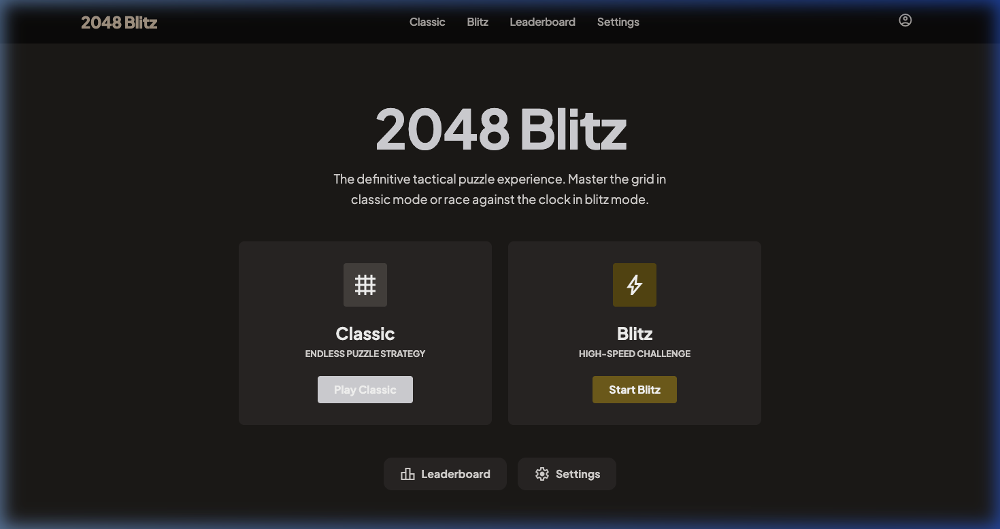
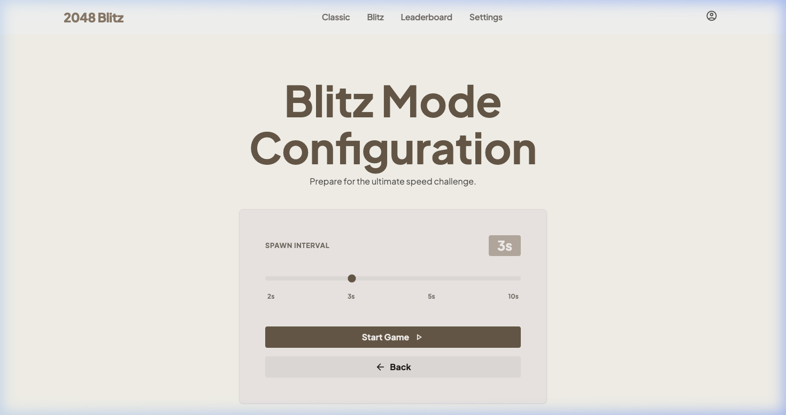
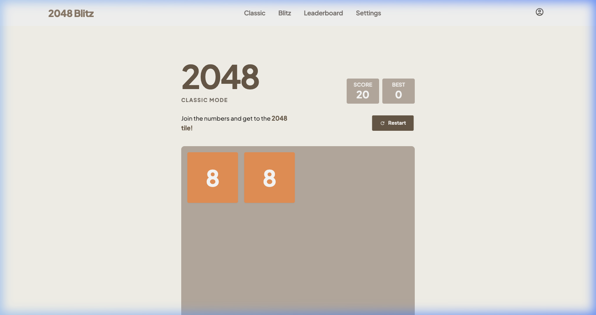
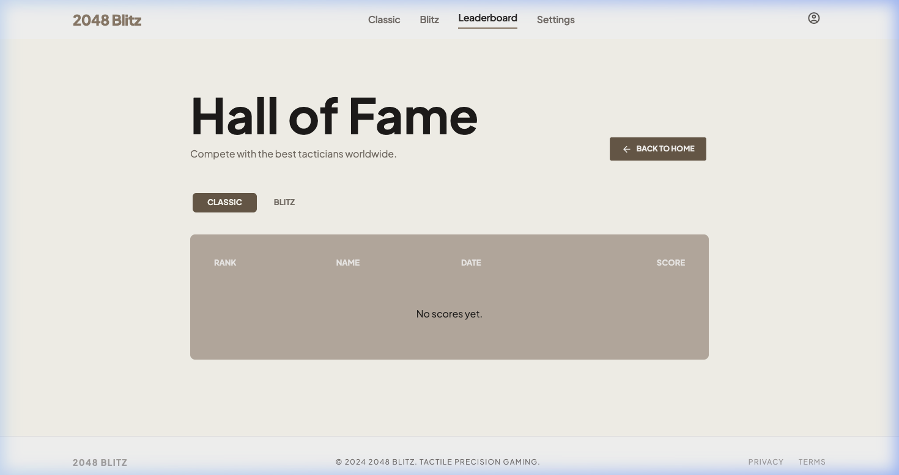
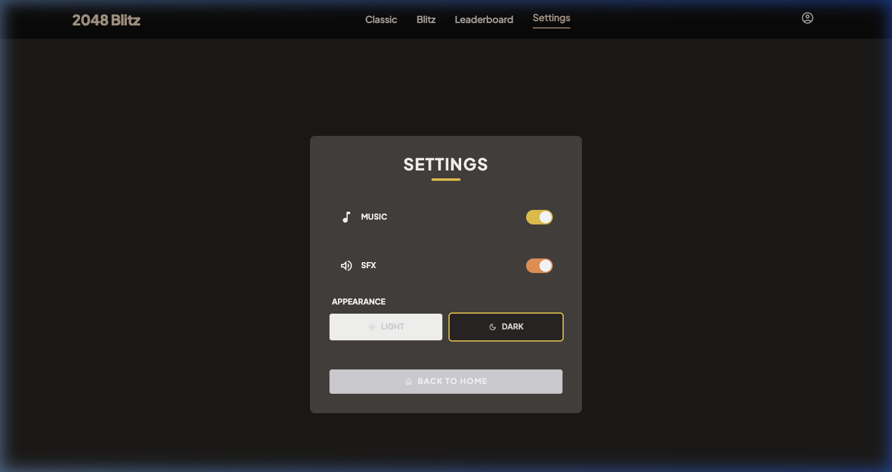

# 2048 Blitz — The Ultimate Tactical Puzzle Experience

2048 Blitz là một trò chơi giải đố hiện đại được xây dựng trên nền tảng Web, lấy cảm hứng từ trò chơi 2048 huyền thoại nhưng được nâng cấp với giao diện cao cấp, chế độ chơi Blitz kịch tính và khả năng tùy biến đa dạng.

*Giao diện màn hình chính của 2048 Blitz trong Chế độ tối (Dark Mode)*

## 🌟 Tính năng nổi bật

### 1. Chế độ Classic (Cổ điển)
Giữ nguyên tinh thần của trò chơi gốc. Người chơi sử dụng các phím mũi tên hoặc vuốt trên màn hình để gộp các ô số cùng giá trị. Mục tiêu là đạt được ô số **2048** và xa hơn nữa.

### 2. Chế độ Blitz (Chớp nhoáng)
Thách thức tốc độ và sự nhạy bén của bạn. Trong chế độ này, các ô số sẽ **tự động xuất hiện** sau mỗi khoảng thời gian cố định (2s, 3s, 5s hoặc 10s), buộc bạn phải tính toán và di chuyển cực nhanh để không bị lấp đầy bảng game.

*Cấu hình thời gian spawn trong chế độ Blitz*

### 3. Thiết kế Responsive & Hiện đại
- **Giao diện cao cấp**: Sử dụng Tailwind CSS với hệ màu sắc được tuyển chọn kỹ lưỡng.
- **Đa nền tảng**: Trải nghiệm mượt mà trên cả máy tính để bàn (Keyboard) và điện thoại di động (Touch/Swipe).
- **Chế độ tối (Dark Mode)**: Chuyển đổi linh hoạt giữa giao diện Sáng và Tối theo sở thích.

*Trải nghiệm chơi game mượt mà với hiệu ứng tactile*

### 4. Hệ thống âm thanh sinh động
- Nhạc nền (BGM) du dương giúp tập trung.
- Hiệu ứng âm thanh (SFX) khi gộp ô và spawn ô mới tạo cảm giác tương tác thực tế.

### 5. Bảng xếp hạng (Hall of Fame)
Lưu giữ những kỷ lục cao nhất của bạn ở cả hai chế độ Classic và Blitz.

*Bảng xếp hạng vinh danh những người chơi xuất sắc nhất*

## 🎮 Cách chơi

1. **Di chuyển**: Sử dụng các phím `↑`, `↓`, `←`, `→` hoặc vuốt trên màn hình điện thoại.
2. **Gộp ô**: Khi hai ô có cùng số chạm vào nhau, chúng sẽ gộp thành một ô có giá trị gấp đôi.
3. **Mục tiêu**: Đạt được điểm số cao nhất có thể trước khi bảng game bị lấp đầy và không còn nước đi hợp lệ.
4. **Blitz Mode**: Hãy chú ý thanh đếm ngược phía trên bảng game. Khi thanh chuyển sang màu đỏ, một ô mới sắp xuất hiện!

## ⚙️ Cài đặt

Bạn có thể tùy chỉnh trải nghiệm chơi game trong màn hình Settings:
- Bật/Tắt Nhạc nền.
- Bật/Tắt Hiệu ứng âm thanh.
- Thay đổi chủ đề giao diện (Light/Dark).

*Màn hình cài đặt tùy biến cao*

## 🛠️ Công nghệ sử dụng

- **HTML5 & CSS3 (Tailwind CSS)**: Cho cấu trúc và giao diện hiện đại.
- **Vanilla JavaScript**: Xử lý logic game, thuật toán gộp ô và hiệu ứng.
- **LocalStorage**: Lưu trữ điểm số và cài đặt người dùng cục bộ.
- **Google Fonts (Plus Jakarta Sans)**: Mang lại trải nghiệm đọc và nhìn cao cấp.

---

© 2024 2048 Blitz. Phát triển bởi Nguyễn Hiếu.
